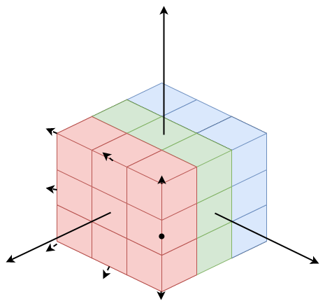
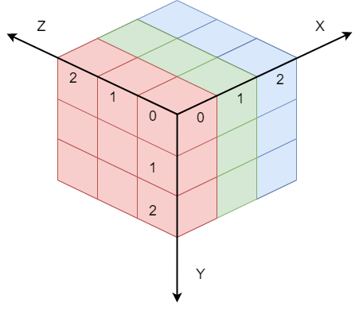
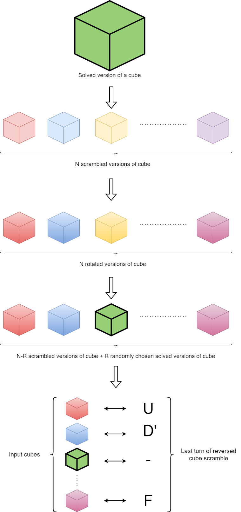

# cubenet
Neural network model for solving Rubik's cube.

# Model architecture

Model consists of 1x 3D Conv, 1x 2D Conv and 2x FC layers:


For 3x3x3 Rubik's cube representation I'm using [this python library](https://github.com/pglass/cube) by Paul Glass. I've created `Ecube` class inheriting `Cube` class from this library, to pass Rubik's cube as an input to neural network model (see method usage [here](#ecube)). 

## Preprocessing

Each individual color of cube has it's ID as a square of two. For example, if colors of cube are red, green, blue, ... then red will have an ID `2^0 = 1`, green - `2^1 = 2`, blue - `2^2 = 4`, etc.
Every piece are representated by individual 3-vectors characterizing location and colors of pieces. 
1. First, XOR of IDs of a piece colors is calculated, so we get an ID of a piece. For example, if a piece has colors with ids 1, 2 and 4, then the ID of this piece is `XOR(1, 2, 4) = 7` and `XOR(001, 010, 100) = 111` in binary representation. 
1. Second, calculated piece ID is multiplied by piece location normal 3-vector. Normal vectors are calculated with the origin in the center of a cube:



So, we get 3x3x3x3 4D matrix with X,Y,Z coordinated with the origin at the **left front top corner** of the cube. For example, to access left front top piece normal vector we need to use coordinates `x = 0, y = 0, z = 0`. To access right back bottom piece normal vector we need to use coordinates `x = 2, y = 2, z = 2`:



Going through each coorinate we get 3 X-slices, 3 Y-slices and 3 Z-slices of a cube as 9x3x3x3 matrix as an input for 3D convolutional layer.

## Output

Output of the neural network model is a vector of shape (17,) or (N, 17), where N is a batch size. Each value of vector is associated with the cube turn. There are 8 clockwise turns, 8 counter-clockwise turns and one `SKIP_TURN = "-"` that does nothing to cube.
To translate network's output to cube turn string use `translate` method:

```python
model = CubeNet()

cube = ECube.get_default_cube() # get solved version of a cube
cube = cube.scramble(5) # scramble cube with 5 random turns and rotations

output = model(output)

turn   = model.translate(output)
```

# ECube

This class inherits `Cube` class from [this python library](https://github.com/pglass/cube). In this section, the main differences and additions will be described.

Almost every method returns `ECube` object. By adding `_` sign at the end of the method's name, you'll apply result of the method to the same `ECube` object.

## Creating default ECube

You can create default ECube using constructor method with no parameters:

```python
ecube = ECube()

print(ecube)
```

Standard cube layot looks like that (see [this python library](https://github.com/pglass/cube) for more info):

```python
    YYY
    YYY
    YYY
BBB RRR GGG WWW
BBB RRR GGG WWW
BBB RRR GGG WWW
    OOO
    OOO
    OOO
```

Or you can get default cube using static method `get_default_cube`:

```python
ecube = ECube.get_default_cube()

print(ecube)
```

## Cube turns

To turn created cube use standart turn notations as method names: R, L, U, D, F, B, M, E, X, Y. Where R is right clockwise turn, L is left clockwise turn, etc. E is clockwise turn of X middle layer. To turn counter-clockwise add `i` at the end of turn name. Add `_` sign at the end of the method's name to apply this turn to the same `ECube` class instance.

```python 
ecube = ecube.D()   # D turn
ecube.D_()          # D turn

ecube = ecube.Ri()  # R' turn
ecube.Ri_()         # R' turn
```

You can also use `turn` method passing string name of turn or list of turns to apply:

```python
ecube = ecube.turn("D'") # D' turn
ecube = ecube.turn("R U R' U'") # R U R' U' turns
ecube = ecube.turn(["R", "U", "R'", "U'"]) # R U R' U' turns

ecube.turn_('U') # U turn
ecube.turn_("R2 U2") # R R U U turns
ecube.turn_(["R", "R", "U", "U"])
```

## Scramble

To scramble cube use `scramble`, `get_scramble_turns`, `get_rotation_turns` methods:

```python
ecube = ecube.scramble(5) # scramble solved version of cube with 5 random turns and rotations
ecube = ecube.scramble(5, with_rotations=False) # scramble solved version of cube with 5 random turns only (no rotations)
ecube = ecube.scramble(5, reset=False) # scramble current version of cube with 5 random turns and rotations
ecube.scramble_(5, reset=False) # scramble current version of cube with 5 random turns and rotations


scramble = ECube.get_scramble_turns(5) # get 5 random scramble turns with rotation turns
ecube = ecube.turn(scramble)

scramble = ECube.get_scramble_turns(5, custom_turns_list=['U', 'R']) # get 5 random scramble turns using only U and R turns
ecube.turn_(scramble)

rotations = ECube.get_rotation_turns(5) # get 5 random rotations of cube
ecube = ecube.turn(rotations)
```

## Cube 4D

You can get 4D numpy matrix representation of cube (see [this section](#preprocessing)) using `cube4D` method:

```python
cube4D = ecube.cube4D()
```

# Training

There are two training methods are implemented: reinforcement learning (see [this file](rl_train.py)) and self-supervised learning (see [this file](self_train.py)).

## Self-supervised learning

In self-supervised learning, each training epoch random batch generated. Each batch sample consists of input for neural network model as a scrambled cube, and target as an one-hot encoded vector with the neural network output shape and only one 1.0 value at the index of correct turn to use for current scramble cube to solve it.



There are two version of self-supervised learning implementations: with sequential difficulty increasing and with fully random batch generation.
Sequential difficulty increasing means that amount of randoms scramble turns will increase successively during training.
Fully random batch generation means that amount of random scramble turns will be always random during training.

## Reinforcement learning

In reinforcement learning method replay memory and replay experience are used with policy to target network update. 
Each epoch cube is randomly scrambled and neural network model is trying to solve it using epsilon-greedy strategy. The value of epsilone is decreasing using `eps_decay` parameter. The reward 1.0 is given if the cube is solved. Also, there is penalty for turns that are occures too often to solve network overfitting problem.

## Starting training in terminal

1. Copy default parameters file in params folder to create you own training parameters. There are two default parameters files for each type of training method.
1. Edit copied parameters file.
1. Open terminal/command line
1. Type this command
```bash
python train.py -p [path to parameters file] --training_type [type of training: self/rl]
```

For example, to start self-supervised training:

```bash
python train.py -p params/default_self_train_params.yaml --training_type self
```